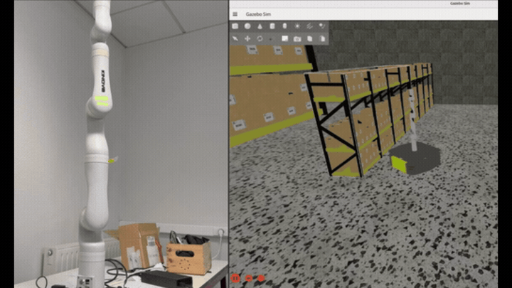

# EPS Mirror Node — ROS2 Sim-to-Real Trajectory Mirroring

A ROS2 custom node developed during the **European Project Semester (EPS)** at LGP Laboratory, ENIT (France).  
This project enables **simultaneous control** of a Gazebo-simulated Kinova Gen3 arm and a physical Kinova Gen3 arm from a single MoveIt2 command.

---

## Background

This project integrates a **Clearpath Ridgeback** mobile platform and a **Kinova Gen3** robotic arm into a unified ROS2 environment.

A key challenge was that the simulated robot and the physical robot use **different joint name conventions**:

| Robot | Joint name format |
|---|---|
| Gazebo simulation | `arm_0_joint_1` |
| Physical Kinova Gen3 | `joint_1` |

This mismatch prevents a single MoveIt2 trajectory from being sent directly to both robots.  
The **mirror node** solves this problem by subscribing to one trajectory source and publishing commands to both robots with the appropriate joint name format.

---

## System Overview

```text
MoveIt2 (RViz)
     ↓
/display_planned_path  (DisplayTrajectory)
     ↓
[ mirror_node ]
     ↓                        ↓
Gazebo simulated arm     Physical Kinova Gen3
(arm_0_joint_X)          (joint_X)
```

The node also accepts direct `JointTrajectory` commands via `/eps_arm/cmd` for terminal-based control.

---

## Demo



*MoveIt2 planned trajectory simultaneously executed on Gazebo simulation and physical Kinova Gen3.*

---

## Result

- Successfully mirrored a single MoveIt2 planned trajectory to both Gazebo simulation and a physical Kinova Gen3.
- Resolved joint name and controller namespace mismatches between simulation and real hardware.
- Built a unified command flow by merging the mirror node and DisplayTrajectory bridge logic into one execution pipeline.
- Validated the command flow in Gazebo simulation before applying it to the physical robot.
- Reduced repeated setup effort by organizing launch files, robot configuration, connection scripts, and setup documentation.

---

## Key Features

- Subscribes to MoveIt2 `DisplayTrajectory` output and extracts executable trajectory commands.
- Normalizes joint names between Gazebo simulation and physical Kinova Gen3 hardware.
- Publishes trajectory commands to both simulation and physical robot controllers.
- Supports direct terminal-based `JointTrajectory` commands via `/eps_arm/cmd`.
- Provides launch files and configuration files for reproducible testing.

---

## Files

| File | Description |
|---|---|
| `eps_mirror_node.py` | Main node — subscribes to MoveIt2 and terminal commands, normalizes joint names, and publishes commands to both robots |
| `display_to_eps_cmd.py` | Bridge node — converts `DisplayTrajectory` to `JointTrajectory`; later integrated into `eps_mirror_node.py` |
| `kinova_mirror_node.py` | Earlier version — mirror-only node without MoveIt2 display topic support |
| `eps_sim.launch.py` | Launch file for full simulation environment, including Gazebo, Nav2, and AMCL |
| `eps_kinova.launch.py` | Launch file for physical Kinova bringup |
| `eps_kinova_connect.sh` | Bash script that automates network configuration and physical robot connection; lab-specific and should be edited before reuse |
| `robot.yaml` | Clearpath robot configuration for Ridgeback, Kinova Gen3, and IMU setup |

---

## Package Structure

These files belong to the following ROS2 workspace layout:

```text
~/clearpath_ws/
└── src/
    ├── eps_bringup/            ← launch files: eps_sim.launch.py, eps_kinova.launch.py
    ├── eps_mirror/             ← mirror node: eps_mirror_node.py, display_to_eps_cmd.py
    ├── clearpath_common/
    ├── clearpath_nav2_demos/
    ├── clearpath_simulator/
    ├── moveit_display_bridge/
    ├── moveit_msgs/
    ├── moveit_resources/
    ├── moveit_task_constructor/
    ├── moveit_visual_tools/
    ├── moveit2/
    ├── moveit2_tutorials/
    ├── ros2_kortex/            ← Kinova Gen3 driver
    ├── ros2_robotiq_gripper/
    ├── rviz_visual_tools/
    └── serial/

~/clearpath/
    ├── robot.yaml              ← robot configuration
    ├── warehouse.pgm           ← map file
    └── warehouse.yaml          ← map metadata
```

---

## Environment

- OS: Ubuntu 24.04
- ROS2: Jazzy Jalisco
- Simulation: Gazebo / Clearpath Simulator
- Motion planning: MoveIt2
- Hardware: Kinova Gen3 7-DoF + Clearpath Ridgeback
- Language: Python

---

## How to Run

### 1. Simulation

```bash
ros2 launch eps_bringup eps_sim.launch.py
```

### 2. Physical Robot

```bash
# Edit IFACE to match your network interface before running this script
chmod +x eps_kinova_connect.sh
./eps_kinova_connect.sh
```

### 3. Mirror Node Only

```bash
ros2 run eps_mirror mirror_node
```

---

## Development Notes

- Developed as part of **Team BOB**, EPS 2025, ENIT France.
- The project was validated in Gazebo simulation before deployment on physical hardware.
- ROS2 Rolling was initially considered, but the environment was migrated to **ROS2 Jazzy** for better compatibility with the Clearpath stack.
- Architecture design, topic-flow analysis, system integration, debugging, validation, and final implementation decisions were performed by **Hyojun Choi**.
- AI tools were used for prototyping support and debugging assistance. Final code decisions, integration, testing, and validation were performed by **Hyojun Choi**.

---

## Design Evolution

The final node, `eps_mirror_node.py`, was developed through a two-stage process.

### Stage 1 — Two Separate Nodes

- `kinova_mirror_node.py` routed `JointTrajectory` commands to both the Gazebo simulation and the physical robot while normalizing joint names for each environment.
- `display_to_eps_cmd.py` converted MoveIt2's `DisplayTrajectory` output into executable `JointTrajectory` commands.

### Stage 2 — Unified Node

- Both functionalities were combined into `eps_mirror_node.py` to simplify the command flow and reduce unnecessary communication overhead.
- The unified node handles both MoveIt2 planned trajectories and direct terminal commands through a single execution pipeline.

---

## Safety and Limitations

- This project was tested in a lab-controlled environment.
- Gazebo simulation was used before physical robot execution.
- The current implementation focuses on trajectory mirroring and command routing.
- Additional safety validation is required before broader deployment, including joint limit checks, emergency stop handling, collision checking, and latency measurement.

---

## Future Work

- Reimplement the node in C++ for improved real-time performance.
- Measure and quantify latency between simulation and physical robot execution.
- Add joint limit validation before publishing commands.
- Add safety checks for abnormal trajectories and controller communication failures.
- Improve documentation for installation, dependency setup, and troubleshooting.

---

## Author

**Hyojun Choi**  
European Project Semester, ENIT France  
GitHub: [CHOI-HYOJUN-kr](https://github.com/CHOI-HYOJUN-kr)
