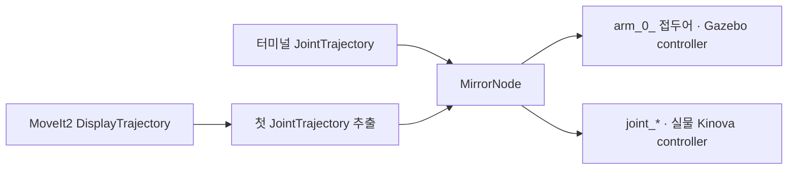

# EPS · ROS2 궤적 변환과 로봇 통합

**같은 계획 궤적을 시뮬레이션과 실물 Kinova의 관절명에 맞게 변환·분배**한 EPS 팀 프로젝트입니다. 제 담당은 Kinova 측 환경 구성과 메시지 연결, 실행 확인이었습니다.

2025.09~12 · ENIT, France · Team BOB, 5인 국제팀 · ROS2 Jazzy / MoveIt2 / Gazebo

*기존 공개 데모 발췌입니다. 화면을 나란히 편집한 장면으로, 두 시스템의 동시 실행이나 동기화 오차를 입증하지 않습니다.*

## 팀의 결과와 내가 맡은 부분

| 구분 | 내용 |
| --- | --- |
| 팀 | 모바일 매니퓰레이터 요구사항·시나리오, 프로젝트 관리·보고서, 결합 시뮬레이션 |
| 본인 | Kinova 제어, ROS2 환경·결합 모델 구성, 토픽·메시지 분석, 궤적 변환·분배, 실행 절차·Setup Guide |
| 팀원 제안 | MoveIt2의 `/display_planned_path`를 궤적 입력으로 활용 |
| AI 활용 | 구조와 인터페이스를 검토한 뒤 코드 초안을 생성하고, 실행 결과를 대조·수정 |

## 핵심 판단: remap만으로 관절명은 바뀌지 않았다

Gazebo는 `arm_0_joint_*`, 실물은 `joint_*`를 기대했습니다. 토픽 경로와 메시지 내부의 `joint_names`를 구분하고, 첫 `JointTrajectory`를 추출해 관절명만 목적지 형식으로 바꿨습니다.

Rolling 구성의 크래시를 확인한 뒤 Jazzy 전환을 제안했습니다. `robot.yaml`은 구성요소를 하나씩 빼고 넣으며 안정 설정을 찾았습니다. 분리된 bridge/mirror는 실행 흐름을 단순화하려고 통합했으며, 통신지연 개선은 측정하지 않았습니다. [문제와 수정 과정](docs/engineering-notes.md)

## 실제로 확인한 범위

결합 Gazebo 모델과 실물 Kinova 팔에서 동작을 확인했습니다. 물리 Ridgeback은 배터리 문제로 전체 실물 시나리오를 완료하지 못했고, LiDAR 플러그인 문제도 남았습니다. [시뮬레이션·실물·미완료 범위](docs/results.md)

## 코드 읽기와 실행

- [메시지 변환 규칙](src/eps_mirror/routing.py) → [ROS2 노드](src/eps_mirror/mirror_node.py)
- [환경·설치·simulation-only 실행](docs/running.md)
- 장비 없이 변환·거부 조건 확인: `python -m unittest discover -s tests -v`

**2026-09 공개 준비 수정:** 패키지 설치 파일, 입력 검사, 실물 출력 기본 비활성화, 테스트를 추가했습니다. 이 코드는 당시 원본에서 정리한 후속 버전이며 ROS2·실물 재시험은 아직 하지 않았습니다. [기존 버전과 변경 범위](docs/maintenance.md)

[English summary](docs/README_EN.md) · [출처·MIT 범위](SOURCES.md)

[다른 프로젝트 보기](https://github.com/CHOI-HYOJUN-kr)
